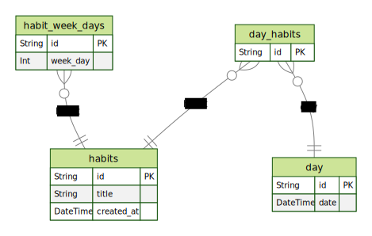

## 💻 Project

Habits is a project that aims to track habits during the week, for example: Working out on Monday, coding on Tuesday, etc.

## ✨ Technologies

This project was developed with the following technologies:

- [ReactJS](https://reactjs.org)
- [ReactNative](https://reactjs.org)
- [TypeScript](https://www.typescriptlang.org/)
- [Vite](https://vitejs.dev)
- [Node](https://nodejs.org/)
- [Prisma](https://www.prisma.io/)
- [Tailwindcss](https://tailwindcss.com/)
- [Fastify](https://www.fastify.io/)
- [Dayjs](https://day.js.org/)
- [Expo-font](https://docs.expo.dev/versions/latest/sdk/font)
- [NativeWind](https://www.nativewind.dev/quick-starts/expo)
- [Phosphor-React](https://www.npmjs.com/package/phosphor-react)
- [Zod](https://www.npmjs.com/package/zod)
- [SVG](https://docs.expo.dev/versions/latest/sdk/svg/)
- [SVG-TRANSFORM](https://github.com/kristerkari/react-native-svg-transformer)
- [Radix](https://www.radix-ui.com/)
- [Radix-REACT-POPOVER](https://www.radix-ui.com/docs/primitives/components/popover)
- [Radix-Progress](https://www.radix-ui.com/docs/primitives/components/progress)
- [REACT-NAVIGATION](https://reactnavigation.org/)
- [React-Native-Screens](https://reactnavigation.org/docs/getting-started/)

## 🔖 Layout

You can view the project layout in the format through [this link](https://app.rocketseat.com.br/event/nlw-setup/ignite/aula-1
). Remembering that you will need to have an account at [Figma](http://figma.com/).

## 🛢️ Database ERM

## 🤔 How to contribute

- Make a fork of this repository;
- Create a branch with your feature: `git checkout -b my-feature`;
- Commit your changes: `git commit -m 'feat: My new feature'`;
- Push to your branch: `git push origin my-feature`.

After your pull request is merged, you can delete your branch.